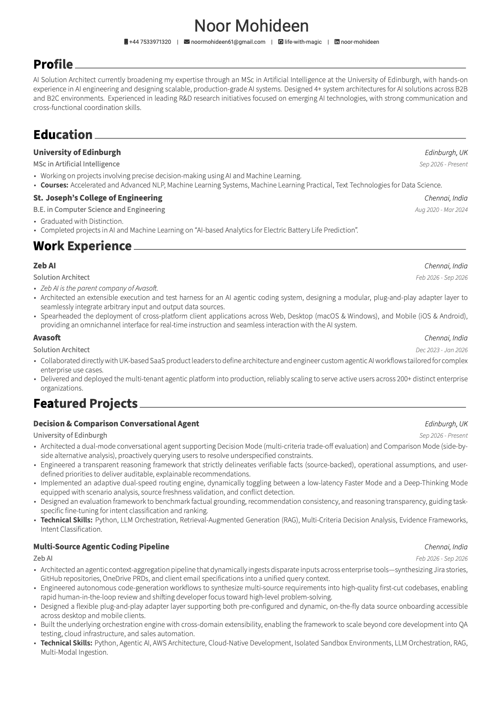
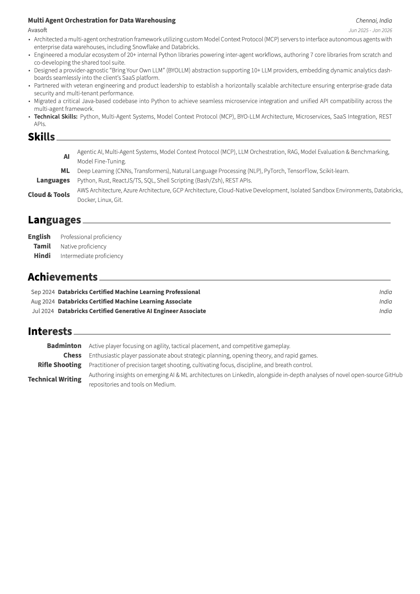

# Noor Mohideen — Resume

<p align="center">
  <a href="resume.pdf">
    
  </a>
  <a href="resume.pdf">
    
  </a>
</p>

<p align="center">
  <a href="resume.pdf"><b>📄 Download / View Full PDF</b></a> •
  <a href="https://linkedin.com/in/noor-mohideen"><b>💼 LinkedIn</b></a> •
  <a href="https://github.com/life-with-magic"><b>💻 GitHub</b></a> •
  <a href="mailto:noormohideen61@gmail.com"><b>✉️ Email</b></a>
</p>

---

## 📌 Profile

**AI Solution Architect** currently broadening expertise through an **MSc in Artificial Intelligence at the University of Edinburgh**, with hands-on experience in AI engineering and designing scalable, production-grade AI systems. Designed 4+ system architectures for AI solutions across B2B and B2C environments. Experienced in leading R&D research initiatives focused on emerging AI technologies, with strong communication and cross-functional coordination skills.

---

## 🎓 Education

* **MSc in Artificial Intelligence** — *University of Edinburgh* (Sep 2026 – Present)
  * Working on projects involving precise decision-making using AI and Machine Learning.
  * **Courses:** Accelerated and Advanced NLP, Machine Learning Systems, Machine Learning Practical, Text Technologies for Data Science.
* **B.E. in Computer Science and Engineering** — *St. Joseph's College of Engineering* (Aug 2020 – Mar 2024)
  * Graduated with Distinction.
  * Completed projects in AI and Machine Learning on "AI-based Analytics for Electric Battery Life Prediction".

---

## 💼 Work Experience

### **Zeb AI** — *Solution Architect* | Chennai, India (Feb 2026 – Sep 2026)
*Zeb AI is the parent company of Avasoft.*
* Architected an extensible execution and test harness for an AI agentic coding system, designing a modular, plug-and-play adapter layer to seamlessly integrate arbitrary input and output data sources.
* Spearheaded the deployment of cross-platform client applications across Web, Desktop (macOS & Windows), and Mobile (iOS & Android), providing an omnichannel interface for real-time instruction and seamless interaction with the AI system.

### **Avasoft** — *Solution Architect* | Chennai, India (Dec 2023 – Jan 2026)
* Collaborated directly with UK-based SaaS product leaders to define architecture and engineer custom agentic AI workflows tailored for complex enterprise use cases.
* Delivered and deployed the multi-tenant agentic platform into production, reliably scaling to serve active users across 200+ distinct enterprise organizations.

---

## 🚀 Featured Projects

* **Decision & Comparison Conversational Agent** — *University of Edinburgh* (Sep 2026 – Present)
  * Dual-mode reasoning agent supporting Decision Mode and Comparison Mode with adaptive follow-up questioning and an auditable fact-vs-assumption framework.
  * *Tech:* Python, LLM Orchestration, RAG, Multi-Criteria Decision Analysis, Evidence Frameworks, Intent Classification.
* **Multi-Source Agentic Coding Pipeline** — *Zeb AI* (Feb 2026 – Sep 2026)
  * Context-aggregation engine synthesizing Jira stories, GitHub repos, OneDrive PRDs, and emails into unified query contexts for autonomous first-cut code generation.
  * *Tech:* Python, Agentic AI, AWS Architecture, Cloud-Native Development, Isolated Sandbox Environments, LLM Orchestration, RAG.
* **Multi Agent Orchestration for Data Warehousing** — *Avasoft* (Jun 2025 – Jan 2026)
  * Multi-agent framework utilizing custom Model Context Protocol (MCP) servers for Snowflake & Databricks, 20+ internal Python libraries, and BYO-LLM abstractions.
  * *Tech:* Python, Java, Multi-Agent Systems, Model Context Protocol (MCP), BYO-LLM Architecture, Microservices, SaaS Integration, REST APIs.

---

## 🛠️ Technical Skills

* **AI:** Agentic AI, Multi-Agent Systems, Model Context Protocol (MCP), LLM Orchestration, RAG, Model Evaluation & Benchmarking, Model Fine-Tuning.
* **ML:** Deep Learning (CNNs, Transformers), Natural Language Processing (NLP), Computer Vision (YOLO), PyTorch, TensorFlow, Scikit-learn, Hugging Face, NumPy, Pandas.
* **Languages:** Python, Rust, ReactJS/TS, SQL, Shell Scripting (Bash/Zsh), REST APIs.
* **Cloud & Tools:** AWS Architecture, Azure Architecture, GCP Architecture, Cloud-Native Development, Isolated Sandbox Environments, Databricks, Docker, Linux, Git.

---

## 🏆 Certifications & Achievements

* **Databricks Certified Machine Learning Professional** — *Sep 2024*
* **Databricks Certified Machine Learning Associate** — *Aug 2024*
* **Databricks Certified Generative AI Engineer Associate** — *Jul 2024*

---

## ⚙️ Building Locally

This resume is built using the **Russell** LaTeX document class and compiled with **XeLaTeX**.

```bash
# Compile to PDF
xelatex resume.tex

# Or compile using latexmk
latexmk -xelatex resume.tex
```
